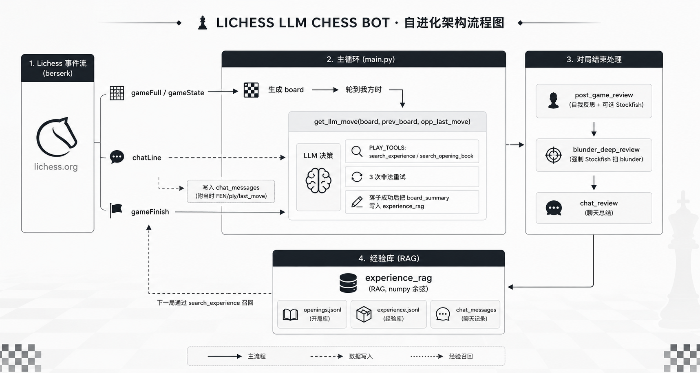

# Lichess LLM Chess Bot

一个挂在 [Lichess](https://lichess.org) BOT 账号下、**完全由大语言模型决策**的国际象棋智能体。
对局中不调用任何象棋引擎（Stockfish 只在赛后复盘时出现），让 LLM 自己阅读局面、计算主要变化、执行下棋动作；
赛后用 Stockfish 找出 blunder，引导模型自我反思，把经验写进 RAG 记忆库，后续对局中自动召回。
支持从 Lichess 聊天框读取人类教练的实时评价（仅赛后总结，不用于实时作弊）。



---

## 功能一览

- **LLM 直接下棋**：每一步由 `.env` 里配置的模型（任意 OpenAI 兼容接口）决策，**对局阶段禁用 Stockfish**。默认开启模型思考，单次回复上限 8192 token，temperature 0.3。
- **结构化思考协议**：模型先判断局面复杂度（simple / medium / complex），再按复杂度决定思考投入，避免无脑长思考；输出固定 JSON，字段顺序即决策顺序：复杂度 → 局面观察 → 候选 → think → PV → move。
- **行棋原则 + 落子前安全检查**：prompt 要求吃子前确认对方能否吃回、不做未经验证的弃子，并在落子前站在对方角度检查落点、失去保护的子和对方最强回应。
- **落子前自检轮**：选出着法后，再单独让模型看一眼走完后的盘面，找出对方最强应着；会白丢子就改选（最多 2 轮，`SELF_CHECK_ROUNDS`）。只让模型自己复查，程序不做任何局面判断。
- **面向人的棋盘表示**：不给 FEN。prompt 里是 ASCII 盘面 + 双方按子种分组的中文子力清单（`王 e1；后 d1；车 a1, h1 …`）+ 局面元信息（轮到谁、是否被将军、易位权、吃过路兵、50 步计数）+ 全部着法历史（SAN）。
- **SAN 记谱**：合法着法列表、模型输出的 candidates/pv/move 全部用 SAN（内部再转 UCI 落子，同时兼容模型误写 UCI / `0-0`）。合法着法列表保留将军符号 `+`；将死的 `#` 也显示为 `+`，只提示"会将军"，不暴露"一步杀"。
- **对方上一步描述**：明确告诉模型对方刚走了什么（SAN、子种、起止格、是否吃子/升变/易位）。
- **RAG 双库**：
  - `data/openings.jsonl` — 开局库，启动时播种经典开局原则。
  - `data/experience.jsonl` — 经验库，滚动增长，涵盖：实时局面快照、赛后自我反思、Stockfish 找到的 blunder 教训、聊天教练总结等。
- **工具调用分层**：对局阶段只暴露 `search_opening_book` / `search_experience`；复盘阶段额外暴露 `analyze_with_stockfish`，从制度上隔离"对局期间无外部引擎"。
- **Stockfish 强制复盘**：赛后扫描整盘 PGN 找所有 ≥200cp 的 blunder，每个让模型看走子前后两张盘面 + SAN 走法历史自行推理失误原因，提出替代走法，再用 Stockfish 评估替代走法的好坏，全部写入经验库。
- **聊天读取（只读）**：游戏中 `chatLine` 事件实时入队，附带当时 ply 与 SAN 走法历史，**对局中模型看不到**，赛后 `chat_review` 统一总结成 `[Chat-Lesson]` 写入经验库。
- **3 次非法走法重试**：模型给出非法着法时把非法原因 + 合法列表回喂，重新生成；三次失败才随机选一个合法着法保底（不做任何局面判断，只避免超时/非法着法判负）。
- **断线重连 + 自动接受挑战**：对局流断开时指数退避重连；自动接受标准规则挑战，其余拒绝。
- **带时间戳的日志**：`logs/YYYYMMDD_HHMMSS.log`，`stdout/stderr` 全部重定向，便于事后排查。
- **60 秒空闲退出**：没有新挑战时优雅退出，便于通过任务计划 / cron 重启。

---

## 架构

```
Lichess 事件流 (berserk)
        │
        ▼
  主循环 (main.py)
    ├── gameFull / gameState ─► 生成 board → 轮到我方时
    │                              └─ get_llm_move(board, prev_board, opp_last_move)
    │                                    ├─ PLAY_TOOLS: search_experience / search_opening_book
    │                                    ├─ 3 次非法重试
    │                                    └─ 落子成功后把 board_summary 写入 experience_rag
    │
    ├── chatLine ─────────────► 写入 chat_messages（附当时 ply 与 SAN 历史）
    │
    └── 对局结束 ─────────────► post_game_review   (自我反思 + 可选 Stockfish)
                                  blunder_deep_review (强制 Stockfish 扫 blunder)
                                  chat_review        (聊天总结)
                                        ▼
                                experience_rag (RAG, numpy 余弦)
                                        ▲
                                        │（下一局通过 search_experience 召回）
```

### 经验库：什么时候写 & 什么时候读

| 触发点 | 前缀 | meta.kind | 时机 |
|---|---|---|---|
| 赛后验证快照 | `[Verified-Snapshot]` | `verified_snapshot` | 对局中缓存，赛后经 Stockfish 验证（Δ<50cp）且去重后才写入 |
| 赛后自我反思 | 教训原文 / `[复盘] ...` | — | 对局结束 |
| Stockfish blunder | `[Blunder-Lesson]` | `blunder` | 对局结束 |
| 模型替代走法评估 | `[Blunder-AltMove]` | `blunder_alt_eval` | 对局结束 |
| 聊天总结 | `[Chat-Summary]` / `[Chat-Lesson]` / `[Chat-Raw]` | `chat_guidance` / `chat_raw` | 对局结束 |

读取：
- **自动召回**：每步用"阶段 + 双方子力 + 最近着法"检索 3 条教训类条目（不含整局总结 / 快照 / 替代走法评估），作为参考放进 prompt。`AUTO_RECALL_K=0` 可关闭。
  实测当前库的召回相似度区分度很低（0.63–0.67），建议用本地对局 A/B 对比开关前后的表现再决定是否保留。
- **主动检索**：模型可随时调用 `search_experience(query)` / `search_opening_book(query)`。

---

## 快速开始

### 1. 准备账号

- 注册一个 Lichess 账号（**不能** 已经下过棋，Lichess 规定）。
- 运行 `upgrade-to-bot.py` 或访问 [账号升级](https://lichess.org/account/oauth/token/create) 把账号转为 BOT。
- 创建 token，勾选至少 `bot:play`、`challenge:read`、`challenge:write`。

### 2. 准备 Stockfish

- 从 [stockfishchess.org](https://stockfishchess.org/download/) 下载对应平台二进制。
- 放到 `PATH`，或通过 `STOCKFISH_PATH` 环境变量指定绝对路径。

### 3. 安装依赖

```powershell
python -m venv .venv
.venv\Scripts\Activate.ps1
pip install -r requirements.txt
```

### 4. 配置环境变量

复制 `.env.example` 为 `.env`，填入真实 key：

```env
LICHESS_TOKEN=lip_xxxxxxxx
LLM_API_KEY=xxxxxxxx
LLM_BASE_URL=https://your-provider/v1
LLM_MODEL=your-model
EMBED_API_KEY=sk-xxxxxxxx
STOCKFISH_PATH=stockfish
STOCKFISH_DEPTH=14
WAIT_TIMEOUT_SEC=60
```

> 代码里默认用 `https://api.qingyuntop.top/v1` 作为 `OpenAI` `base_url`。如你用官方 API，改 `main.py` 里的 `OpenAI(..., base_url=...)` 那行即可。

### 5. 启动

```powershell
python main.py
```

终端会同时写一份 `logs/YYYYMMDD_HHMMSS.log`。
到 [Lichess 对局大厅](https://lichess.org/?any#hook) 用另一个账号挑战你的 BOT 即可开下。

---

## 配置项

所有配置通过环境变量（`.env`）：

| 变量 | 默认 | 说明 |
|---|---|---|
| `LICHESS_TOKEN` | — | **必填**。Lichess BOT token |
| `LLM_API_KEY` | — | **必填**。下棋 / 复盘 LLM key（兼容旧的 `XIAOMI_API_KEY`） |
| `LLM_BASE_URL` | mimo 地址 | LLM 的 OpenAI 兼容 Base URL |
| `LLM_MODEL` | `mimo-v2.5-pro` | 模型名 |
| `LLM_EXTRA_BODY` | `{}` | 供应商私有参数（JSON，原样合并进请求体）。deepseek-v4-flash（micuapi）默认即开启思考，传 `thinking` 对象反而会关闭；可设 `{"reasoning_effort": "high"}` |
| `LLM_MAX_TOKENS` / `LLM_TEMPERATURE` | `8192` / `0.3` | 下棋阶段单次回复上限（含思考）与采样温度 |
| `AUTO_RECALL_K` | `3` | 每步自动召回的经验条数，`0` 关闭 |
| `SELF_CHECK_ROUNDS` | `2` | 落子前自检最多轮数，`0` 关闭 |
| `EMBED_API_KEY` | — | **必填**。Embedding（RAG）key（兼容旧的 `OPENAI_API_KEY`） |
| `EMBED_BACKEND` | `api` | `api` 走 OpenAI 兼容接口；`local` 进程内跑本地模型（离线） |
| `EMBED_BASE_URL` / `EMBED_MODEL` | qingyuntop / `text-embedding-3-small` | `api` 后端的接口与模型（可指向本地 Ollama 的 `/v1`） |
| `EMBED_LOCAL_MODEL` / `EMBED_DEVICE` | `BAAI/bge-m3` / 自动 | `local` 后端的模型（HF 名称或本地目录）与设备 |
| `STOCKFISH_PATH` | `stockfish` | Stockfish 路径 |
| `STOCKFISH_DEPTH` | `14` | 赛后分析深度，越大越慢 |
| `WAIT_TIMEOUT_SEC` | `60` | 空闲等待挑战的最大秒数 |

### 本地 embedding（离线）

```powershell
pip install sentence-transformers
# .env 中设置
#   EMBED_BACKEND=local
#   EMBED_LOCAL_MODEL=BAAI/bge-m3
python reembed.py        # 用新模型重算 data/*.jsonl 的向量（自动备份，文本不变）
```

首次运行会从 HuggingFace 下载模型；无法联网时，可先手动下载到本地目录，再把 `EMBED_LOCAL_MODEL` 指向该目录。
换了 embedding 模型却没运行 `reembed.py` 时，程序会跳过维度不匹配的旧向量并给出提示，不会崩溃。

### 观战页面（可选）

游戏进程会把当前局面、模型每一步的思考 / 候选 / 工具调用写到 `live/state.json`，独立的小服务读取并在浏览器展示，本地对局和 Lichess 对局通用，只依赖标准库：

```powershell
python viewer.py            # 打开 http://127.0.0.1:8000
python local_play.py        # 另开一个终端开一局
```

页面功能：实时棋盘（按我方视角摆放，标出上一步）、着法列表（点击或 ← → 键回看任意局面）、模型思考中的计时与已调用的工具、每一步的 think / 局面观察 / 候选着法 / PV / 工具结果，以及非法着法重试和随机保底的醒目提示。

---

## Prompt 设计要点

### SYSTEM_PROMPT

严格 JSON 输出，模型每步必须给全下列字段：

- `complexity` · `complexity_reason`：先判断复杂度，决定思考投入
- `opp_intent` · `my_attacked` · `opp_attacked` · `my_hanging` · `opp_hanging`
- `check_chance` · `capture_chance` · `threats` · `tactics`
- `candidates[]`：候选（simple 1-2 个 / medium 2-3 个 / complex 3-5 个），每项含 `move/pros/cons`
- `think`：推理总结（simple ≤80 字 / medium ≤200 字 / complex ≤400 字），含安全检查结论
- `pv[]`：由 think 推出的主变 SAN 列表，`move` 必须 `== pv[0]`
- `board_summary`：≤80 字局面骨架（用于以后向量检索）
- `move`：最终着法（SAN），必须在合法走法列表里

Prompt 顶部显式声明「只能走自己颜色的子，盘面 W* = 白，B* = 黑」。

### user_prompt

每步注入：
- 当前 ASCII 盘面
- 对方刚走的一步（人话描述）
- 对局至今的全部着法（SAN）
- 我方 / 对方子力清单（中文全称 + 格子）
- 局面元信息（被将军、易位权、吃过路兵、50 步计数）
- 经验库自动召回的教训（仅供参考）
- 合法走法（SAN，带 + 表示将军）

---

## 已知限制 / 后续可改进

- LLM 在**中残局精确计算**上弱，开局靠模式识别，越到残局越容易丢子。
- 每一步都开新 messages，只通过 SAN 走法历史了解之前的对局，看不到自己上一步的思考。
- 单次采样，没有 best-of-N 投票，中残局一次直觉错就落子。
- 经验库无去重 / 淘汰策略，长期运行后向量检索噪音会变大。

---

## 目录结构

```
lichess-bot/
├── main.py                 # 主程序：事件循环、LLM 决策、复盘
├── rag.py                  # 极简 RAG（numpy 余弦）
├── logger_setup.py         # 日志 + stdout/stderr 重定向
├── local_play.py           # 本地对局（默认对手随机走子；也可 Stockfish / 人类 / 自对弈）
├── live.py                 # 实时状态输出（live/state.json）
├── viewer.py + web/        # 观战页面
├── reembed.py              # 换 embedding 后重建向量
├── upgrade-to-bot.py       # 把普通账号升级为 BOT
├── requirements.txt
├── .env.example
├── LICENSE                 # MIT
├── data/                   # 运行时生成（gitignore）
│   ├── openings.jsonl
│   └── experience.jsonl
├── games/                  # 每盘 PGN 存档（gitignore）
├── logs/                   # 运行日志（gitignore）
└── stockfish/              # 自带 Stockfish 二进制（gitignore）
```

---

## License

[`MIT LICENSE`](./LICENSE)。
